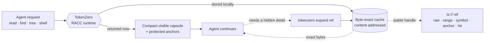
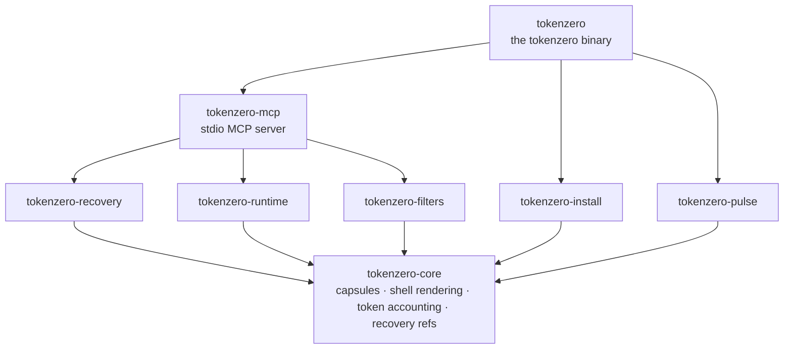

<div align="center">


<br/>
<br/>
<br/>

Un runtime de Rust con enfoque local que reduce lo que ven los agentes de IA, mientras mantiene un
**control de recuperación byte por byte exacto** para todo lo que oculta.

[](LICENSE)
&nbsp;
[](#mcp)
&nbsp;
[](#download--install)
&nbsp;
[](https://ko-fi.com/adityavg13)
&nbsp;
[](https://rust-lang.org)

<br/>

<a href="#highlights">Destacados</a> &nbsp;·&nbsp;
<a href="#how-racc-works">Cómo funciona</a> &nbsp;·&nbsp;
<a href="#demo">Demo</a> &nbsp;·&nbsp;
<a href="#architecture">Arquitectura</a> &nbsp;·&nbsp;
<a href="#download--install">Instalación</a> &nbsp;·&nbsp;
<a href="#commands">Comandos</a> &nbsp;·&nbsp;
<a href="#mcp">MCP</a> &nbsp;·&nbsp;
<a href="#codemode">CodeMode</a> &nbsp;·&nbsp;
<a href="#choosing-a-mode">Elegir un modo</a> &nbsp;·&nbsp;
<a href="#zerostack">ZeroStack</a> &nbsp;·&nbsp;
<a href="#docs">Documentación</a> &nbsp;·&nbsp;
<a href="#support">Soporte</a>

</div>

---

<h3 id="highlights"></h3>

<div align="center">


</div>

> La mayoría de los compresores recuperan contexto **desechando información**, por lo que el agente
> pierde silenciosamente un detalle que al final resulta necesitar. TokenZero devuelve una cápsula compacta
> *ahora* y conserva los bytes omitidos detrás de una referencia local exacta. Los ahorros se cuentan
> **después** de cualquier recuperación, no solo por la reducción de tokens visibles.

Las lecturas pequeñas pasan sin alteraciones; las grandes se colapsan en una cápsula, y ambas permanecen
**recuperables byte por byte exactas**. Reproduzca cualquier fila con `tokenzero read <file> --json`
y lea el bloque `accounting`:

| Entrada | Tokens crudos | Visibles | Resultado |
| :-- | --: | --: | :-- |
| Archivo fuente de 204 líneas | 1,698 | 1,698 | devuelto completo; una cápsula nunca cuesta más que lo crudo |
| Archivo fuente de 796 líneas | 7,722 | 287 | **96.3%** más pequeño, bytes exactos a una `expand` de distancia |
| Archivo fuente de 1,539 líneas | 12,908 | 259 | **98.0%** más pequeño, bytes exactos a una `expand` de distancia |
| Salida ruidosa de shell | 1,237 | 212 | **82.9%** más pequeño, flujo completo recuperable |

Las rutas críticas se miden, no se asumen: `cargo bench` fija el conteo de tokens, el encuadramiento de cápsulas y el renderizado de shell a escala de microsegundos en la suite de criterio del espacio de trabajo.

#### Prueba de rendimiento extremo a extremo

Seis cargas de trabajo reproducibles en este repositorio, medidas con un binario de versión fija. Ambos lados usan la contabilidad propia de TokenZero, y cada byte oculto permanece recuperable a través de una `tz://` ref exacta. La instantánea actual, metodología, procedencia y desviación por celda residen en `docs/benchmarks.md`, regeneradas de extremo a extremo por un solo comando, `benchmarks/run_all.sh`:

Los fixtures sintéticos grandes se generan bajo demanda desde `tests/perf-corpus-manifest.json`; nunca son artefactos de código fuente o lanzamiento. Use `uv run python scripts/perf_corpus.py generate`, luego `verify`, y finalice con `clean --all`. Las ejecuciones remotas usan la misma ruta descartable: `rch exec -- uv run python scripts/perf_corpus.py generate`.

| Carga de trabajo | Tokens crudos | TokenZero | Ahorro |
| :-- | --: | --: | --: |
| Lectura de fuente grande | 1,744 | 45 | **97.0%** |
| Relectura del mismo archivo (deduplicación de conjunto visto) | 1,744 | 45 | **97.0%** |
| Grep en todo el repo (`fn ` en `crates/`) | 90,541 | 487 | **99.0%** |
| `cargo test` (`tokenzero-filters`) | 292 | 80 | **72.0%** |
| Listado de directorio (find vs tree, profundidad 3) | 37,530 | 541 | **98.0%** |
| Reencuentro de contenido almacenado (`recall` vs volver a ejecutar grep) | 90,541 | 46 | **99.0%** |
| **Total** | **222,392** | **1,244** | **99.0%** |

Trate el total del **99.0%** como una estimación puntual de suite fija solo para estas seis cargas de trabajo; no es una afirmación sobre la población de cargas de trabajo o una versión. Una instantánea comprometida no proporciona un intervalo de confianza poblacional. La publicación pública/para lanzamientos de este titular sigue sujeta a `tokenzero claim-audit` (`public_claims_approved` / `release_publication_allowed`).

#### Instantánea de suite (desde la versión v1.4.0)

Regenerado el 2026-07-27 en un Apple M5 Max (RUNS=5, WARMUP=1, tokenzero 1.4.0)
por `benchmarks/run_all.sh`; tablas completas, desviación y procedencia en
`docs/benchmarks.md`.

Latencia de arranque en frío (hyperfine p50): inicio de proceso 4 ms, apertura de store 107 ms,
primera lectura 116 ms, primera expansión 342 ms. Impuesto de arranque (primera lectura en frío menos
inicio de proceso): 112 ms.

Costo de tokens vs CLI crudo, mismo corpus y tarea idéntica:

| Tarea | CLI crudo (tokens est.) | TokenZero | Ahorro |
| :-- | --: | --: | :-- |
| Leer 500 líneas | 5,817 | 24 | **99.6%** |
| Grep + leer | 370 | 242 | **34.6%** |
| Tree + glob + leer | 10,492 | 555 | **94.7%** |
| Editar + verificar | 5 | 195 | CLI crudo más barato (edición mínima; sobrecosto de cápsula declarado, no oculto) |
| Navegación multifase | 27,831 | 443 | **98.4%** |

Repositorio sintético de un millón de líneas (1,000 archivos, aguja plantada): las 5 tareas de navegación
se completan en 1,349 tokens visibles contra un presupuesto de 32,000 tokens (4.2%
de utilización), con recuperación byte por byte exacta verificada en cada tarea.

CodeMode vs esquema MCP: tareas idénticas ejecutadas como planes CodeMode pasan todas
las verificaciones de calidad sin pagar tokens de esquema de herramienta por llamada; las filas equivalentes
de esquema MCP pagan 52-199 tokens de entrada por llamada antes de que ocurra cualquier trabajo.
Las filas CodeMode inician en frío un servidor stdio por plan (2.5-5.7 s reales), el peor caso declarado.

Las salidas solo de ruta como `glob` pasan casi sin cambios: no hay nada que ocultar, y una cápsula
nunca cuesta más que lo crudo.

#### Medido en producción

En **~20,000 llamadas a herramientas enrutadas** de sesiones reales de agentes en una
máquina de desarrollo (seis días, múltiples arneses de IA): la salida cruda de herramientas
totalizó **38.1M de tokens**; **17.9M de ellos (47%) nunca entraron en el contexto del modelo**. Al contar hacia atrás cada token que los agentes recuperaron luego con `expand`,
los ahorros netos fueron del **30%** en ese registro local Pulse. Trate esto como telemetría
de despliegue, no como una afirmación de lanzamiento; las afirmaciones para lanzamientos están sujetas a
artefactos de `tokenzero claim-audit`. El paquete de evidencia auditable para este párrafo fue recortado del
checkout público; regenere el registro con `tokenzero pulse export-jsonl` si lo
necesita. Los totales históricos no están auditados para lanzamiento en este checkout hasta que se adjunte
un registro coincidente.

<h3 id="how-racc-works"></h3>

**RACC** son las siglas de **Recovery-Aware Context Compression** (Compresión de Contexto Consciente de Recuperación). El objetivo no es la
respuesta más corta posible; es el **menor costo total de tarea** mientras la recuperación exacta
permanece a una llamada de distancia.



TokenZero puede omitir texto de la cápsula visible **solo** cuando ya está
representado por un anclaje protegido, es recuperable a través de una referencia local exacta, o el
modo declara explícitamente compresión con pérdida e indica que puede ser necesaria una recuperación.
Las refs exactas son controles locales, no cargas útiles legibles por el modelo, por lo que una evaluación honesta
cuenta cualquier salida `expand` posterior que el agente utilice realmente.

**Por qué la conciencia de recuperación supera al resumen con pérdida.** Un resumidor hace una
apuesta irreversible: decide, antes de que la tarea termine, qué detalles el
agente nunca necesitará. Cuando la apuesta falla, el agente vuelve a leer archivos, vuelve a ejecutar
comandos o llena silenciosamente el vacío con un suposición. RACC nunca tiene que apostar.
Oculta agresivamente porque ocultar es reversible: cada byte omitido permanece
direccionable detrás de una `tz://` ref local, y un agente que lo necesite obtiene los
bytes originales exactos de vuelta en una sola llamada. La contabilidad sigue el mismo
principio: los tokens que un agente recupera luego se restan de los ahorros reclamados,
porque la compresión que tuvo que deshacer nunca fue un ahorro en absoluto.

<h3 id="demo"></h3>

Ejecute la demo autocontenida de RACC desde la raíz del repositorio:

```powershell
pwsh -File ./demo/run_demo.ps1 -OpenViz
```

La demo requiere PowerShell 7+ (`pwsh`) en Windows, Linux o macOS.
Resuelve `tokenzero` desde `PATH`, reutiliza `demo/.tokenzero-bin/`, o descarga
el activo de lanzamiento coincidente para el sistema operativo actual. Escribe `demo/demo_results.json`
y `demo/demo_viz.html`, luego muestra tokens crudos, tokens visibles,
ahorros conscientes de recuperación y prueba de expansión byte por byte exacta.

Para ejecuciones en vivo de agentes:

```powershell
pwsh -File ./demo/run_agent_demo.ps1 -Replicates 3
```

Consulte [`demo/README.md`](demo/README.md) para las opciones y los visores generados.

<h3 id="architecture"></h3>

TokenZero es un espacio de trabajo de Rust en capas compuesto por ocho crates enfocados. Todo se construye sobre un
único crate base; el servidor MCP y el CLI componen el resto. El gráfico de dependencias
es acíclico; ningún crate retrocede a una capa superior.



| Crate | Responsabilidad |
| :-- | :-- |
| `tokenzero-core` | Cápsulas, renderizado adaptativo de shell, contabilidad de tokens, tipado de contenido: la base sobre la que depende cada otro crate |
| `tokenzero-recovery` | Almacén direccionable por contenido, exacto a nivel de byte detrás de las refs `tz://`; evicción acotada y persistencia a prueba de fallos |
| `tokenzero-runtime` | Ejecución de procesos multiplataforma con captura de flujos y volcado en disco |
| `tokenzero-filters` | Reescritura conservadora de comandos y veredicos de seguridad para comandos destructivos |
| `tokenzero-install` | Integración de agente (plan / aplicar / revertir), diagnósticos `doctor`, auditoría de paquete `package-audit` |
| `tokenzero-pulse` | Registro de telemetría local (JSONL ↔ SQLite) para que los ahorros se contabilicen honestamente, después de la recuperación |
| `tokenzero-mcp` | El servidor MCP stdio determinista: motor, despacho de herramientas, supervisor a prueba de fallos |
| `tokenzero` | El binario `tokenzero` y su superficie de comandos |

La compilación desde el código fuente y el diseño completo del espacio de trabajo se encuentran en [`docs/development.md`](docs/development.md).

<h3 id="download--install"></h3>

Descargue el archivo para su sistema operativo desde el [último Lanzamiento](https://github.com/AdityaVG13/tokenzero/releases):

| SO | Activo |
| :-- | :-- |
| Windows | `tokenzero-<version>-x86_64-pc-windows-msvc.zip` |
| Linux | `tokenzero-<version>-x86_64-unknown-linux-gnu.tar.gz` |
| macOS (Apple Silicon) | `tokenzero-<version>-aarch64-apple-darwin.tar.gz` |
| macOS (Intel) | `tokenzero-<version>-x86_64-apple-darwin.tar.gz` |

Extraiga el archivo, coloque `tokenzero` (o `tokenzero.exe`) en `PATH`, luego:

```bash
tokenzero install --global --plan  --mcp --shell --cli --json   # previsualizar, sin escritura
tokenzero install --global --apply --mcp --shell --cli --json   # aplicar configuración local segura
tokenzero doctor --json                                         # confirmar estado
```

Cada paso de instalación planifica antes de escribir y registra datos de reversión; reprodúzcalo con
`tokenzero install --rollback <id>` para revertir una aplicación.

<details>
<summary><b>¿Prefiere dejar que su agente de IA lo haga?</b> Pegue este prompt.</summary>

<br/>

```text
Instala TokenZero para mí desde el último Lanzamiento de GitHub en
https://github.com/AdityaVG13/tokenzero/releases. Elige el activo para mi SO,
verifica la suma de comprobación SHA256, coloca el binario tokenzero en PATH, ejecuta el plan de
instalación global, aplica la configuración MCP/shell/CLI solo si el plan es seguro, luego ejecuta
tokenzero doctor --json y muéstrame el resultado.
```

</details>

Se está preparando un tap de Homebrew (AdityaVG13/homebrew-zerostack); las compilaciones desde el código fuente
son el canal soportado hoy. Consulte [`docs/development.md`](docs/development.md).

## Instalación / Compilación

```bash
git clone https://github.com/AdityaVG13/tokenzero
cd tokenzero
cargo build --release
```

`rust-toolchain.toml` fija automáticamente el toolchain nightly. El binario se coloca en
`target/release/tokenzero`.

## Inicio rápido (agentes)

Pegue esto en su agente de IA y configurará TokenZero de extremo a extremo:

```text
Configura TokenZero desde https://github.com/AdityaVG13/tokenzero para mí:
1. Clónalo y ejecuta `cargo build --release` (rust-toolchain.toml fija el toolchain).
2. Registra `target/release/tokenzero mcp-server --mode=mcp` como un servidor MCP stdio llamado "TokenZero" en mi configuración de agente.
3. Si mi arnés soporta ejecución de planes CodeMode ZeroStack, registra `target/release/tokenzero mcp-server --mode=codemode` EN VEZ DE y nunca ambos.
4. Verifica: llama a `tokenzero read README.md --json` contra este repositorio y reporta el sobre de respuesta más los ahorros de tokens.
```

Un prompt único para todo ZeroStack se publicará cuando aterrice el metallanzamiento unificado ZeroStack; hasta entonces, cada motor se configura de forma independiente.

<h3 id="commands"></h3>

Cada comando acepta `--json` para un sobre estable con versión de esquema. Los alias coinciden con los
nombres de las herramientas MCP a continuación.

<table>
<tr>
<td valign="top" width="50%">

**Leer y buscar**

- `read <path>`: salida visible compacta + refs exactas
- `find <query> [path]`: búsqueda de contenido recuperable
- `grep <pattern> [path]`: búsqueda regex / literal exacta primero
- `glob <pattern>`: coincidir rutas de archivos, sin contenidos
- `tree [path] --depth N`: forma acotada del repo
- `run -- <command>`: captura de shell / prueba / registro

**Recuperar y transformar**

- `expand <ref>`: recuperar cargas útiles, rangos, símbolos, anclajes
- `recall <query>`: búsqueda de texto completo en toda la caché
- `fetch <url>`: obtención HTTP en caché detrás de una ref
- `ingest --stdin --kind <k>`: almacenar salida externa detrás de refs
- `edit <path>`: ediciones de archivo de múltiples parches, todo o nada

</td>
<td valign="top" width="50%">

**Medir e inspeccionar**

- `stats`: contabilidad de ahorros (crudo vs visible, después de recuperación)
- `pulse`: sincronización de registro de telemetría, exportación, doctor
- `mem`: inspeccionar estado de recuperación / caché
- `cache`: estado y poda de caché
- `cache-pack`: compactar una sesión en un pack portátil
- `discover`: comandos / filtros / preparación del runtime
- `rewrite-command <cmd>`: decisiones de reescritura conservadoras

**Instalación, estado y MCP**

- `doctor --json`: estado central + límites de configuración
- `install --plan` / `--apply` / `--rollback <id>`: configuración planificada con reversión
- `clients --json`: detectar agentes de IA instalados
- `mcp-server`: ejecutar el servidor MCP stdio de Rust
- `mcp-smoke` / `mcp-soak --json`: conformidad + durabilidad de caos
- `package-audit --json`: auditoría de empaquetado de lanzamiento

</td>
</tr>
</table>

<h3 id="mcp"></h3>

`tokenzero mcp-server` expone herramientas deterministas de stdio, cada una con un alias corto. El
nombre canónico `tz_*` y el alias son intercambiables.

| Herramienta | Alias | | Herramienta | Alias |
| :-- | :-- | :-: | :-- | :-- |
| `tz_read` | `read` | | `tz_ingest` | `ingest` |
| `tz_find` | `find` | | `tz_expand` | `expand` |
| `tz_grep` | `grep` | | `tz_recall` | `recall` |
| `tz_glob` | `glob` | | `tz_fetch` | `fetch` |
| `tz_tree` | `tree` | | `tz_mem` | `mem` |
| `tz_shell` | `shell` | | `tz_cache_pack` | `cache_pack` |
| `tz_edit` | `edit` | | `tz_rewrite` | `rewrite` |
| `tz_batch` | `batch` | | `tz_discover` | `discover` |

El servidor se basa en **FastMCP**: mismas herramientas, esquemas y cargas útiles, con una
construcción que integra semánticas de fallos de grado de producción.

- **Presupuestos de solicitud.** Cada llamada lleva un presupuesto de tiempo de espera. Una operación colgada devuelve un
  error limpio de presupuesto excedido, no un bloqueo del agente.
- **Cancelación correcta.** Una desconexión del cliente no puede dejar un resultado parcialmente escrito. El
  servidor cancela el trabajo en vuelo atómicamente; la siguiente llamada ve un estado coherente.
- **Resultados de 4 valores.** Cada invocación se resuelve exactamente en `success`, `cancelled`,
  `failed`, o `panicked`. Cancelled no es failed, y failed no es panicked;
  el arnés puede bifurcarse según la distinción en lugar de adivinar desde una
  cadena de error genérica.

El servidor negocia el protocolo MCP a través de `2025-03-26`, `2025-06-18` (predeterminado), y
la versión candidata `2026-07-28`. El JSON mal formado y las llamadas canceladas o fallidas devuelven
errores estructurados **sin terminar el servidor**; un supervisor a prueba de fallos
reinicia un trabajador fallido a mitad de sesión.

Las banderas de lanzamiento no cambian:

- `tokenzero mcp-server --mode=mcp` (predeterminado): las herramientas por operación.
- `tokenzero mcp-server --mode=codemode`: la herramienta ejecutora única.

La documentación por herramienta se encuentra en `resource://tokenzero/tools`.

<h3 id="codemode"></h3>

Las tablas anteriores reducen lo que cada operación **devuelve**. CodeMode reduce por cuántas operaciones **paga**. Los dos efectos se multiplican.

CodeMode está integrado en TokenZero mismo. No necesita nada más que este repositorio:
`tokenzero mcp-server --mode=codemode` convierte las mismas 18 operaciones en una
única herramienta ejecutora, `tz_execute_code`. (FSZero y GraphZero incluyen cada uno el mismo modo para sus propias superficies, y el hub opcional ZeroStack unifica los tres; ninguno de eso es requerido para usar CodeMode aquí.)

En modo MCP, una tarea de cinco pasos cuesta cinco idas y vueltas, y cada resultado
intermedio aterriza en el contexto del modelo ya sea que lo necesite o no. En
CodeMode el agente envía un plan corto; el servidor ejecuta cada paso; solo el
resultado final y sus refs entran en contexto. Tres propiedades derivan de eso:

1. **Los intermedios son gratuitos.** Un `read` que solo alimenta un `compact` nunca
   aparece. El modelo nunca gasta tokens en datos que iba a transformar
   de todos modos.
2. **Una ida y vuelta por tarea, no por paso.** Latencia y sobrecosto de llamada de herramienta
   se pagan una sola vez.
3. **Las refs encauzan entre pasos.** `$c.ref` del paso uno es una entrada válida para
   el paso dos, del lado del servidor, sin modelo en el ciclo.

#### Prueba de composición de planes

Tres tramos, mismas cargas de trabajo, mismo tokenizador. **Crudo** es lo que consume un agente sin
ZeroStack: los bytes reales del subprocess y archivo. **Por-op** son
las herramientas MCP propias de TokenZero, ya comprimidas por RACC. **CodeMode** es el cableado v2
del plan.

| Carga de trabajo | Crudo | Por-op | CodeMode | vs crudo | vs por-op |
| :-- | --: | --: | --: | --: | --: |
| Archivo + búsqueda + transformación | 1,985 | 145 | 93 | **95.3%** | 35.9% |
| Shell multifase (3 comandos) | 85 | 139 | 209 | **-145.9%** | -50.4% |
| Composición de tubería (read + compact) | 537 | 126 | 103 | **80.8%** | 18.3% |
| Exploración mixta (tree + glob + read) | 1,315 | 273 | 310 | **76.4%** | -13.6% |
| Revisión de diff (multi-archivo) | 20,139 | 3,131 | 107 | **99.5%** | 96.6% |
| Exploración multi-archivo (300 hits) | 3,332 | 344 | 114 | **96.6%** | 66.9% |
| Resumen de logs (100 commits a veredicto) | 929 | 218 | 21 | **97.7%** | 90.4% |
| **Total** | **28,322** | **4,376** | **957** | **96.6%** | **78.1%** |

Dos notas sinceras. En cadenas de juguetes con salida cruda diminuta, CodeMode puede costar más
tokens visibles que lo crudo: las salidas de shell pequeñas llegan en línea por diseño, porque
ocultar 200 tokens detrás de una ref cuesta al agente varias idas y vueltas para
recuperarlas. Y dos cargas de trabajo de juguete leen más baratas a través de herramientas por-op que a través de un
plan. CodeMode gana su mantenimiento en trabajo real: revisión de diff, exploración amplia,
resumen de logs. Las cargas de trabajo a escala se ejecutan contra un corpus sintético
estable a nivel de byte, por lo que dos ejecuciones consecutivas producen conteos de tokens idénticos.

Reproductible: `scripts/benchmark_composition.sh` o
`cargo test -p tokenzero-mcp -- codemode::bench_tests::run_composition_benchmark`.
Artefacto: `demo/composition_benchmark.json`.

Ejecute un plan localmente sin ningún arnés:

```bash
tokenzero codemode --json --root . --plan '{"steps":[{"id":"c","method":"zero.token.compact","args":["payload"]},{"id":"e","method":"zero.token.expand","args":["$c.ref"]}],"return":{"text":"$e.text","ref":"$c.ref"}}'
```

<h3 id="choosing-a-mode"></h3>

TokenZero ofrece dos superficies MCP construidas sobre el mismo conjunto de operaciones y la misma
tienda de recuperación. Elija uno por arnés. Ejecutar ambos duplica la superficie de herramientas
y re-infla lo que los planes comprimen.

| | Modo MCP | CodeMode |
| :-- | :-- | :-- |
| **Superficie** | 18 herramientas por operación (`tz_read`, `tz_find`, ...) | 1 herramienta ejecutora (`tz_execute_code`) |
| **Patrón** | MCP estándar: una llamada de herramienta por operación | Planes: N operaciones en una llamada |
| **Idas y vueltas** | Una por operación | Una por plan |
| **Ideal para** | Cualquier arnés MCP (Claude, Codex, Cursor, ...) | Cualquier arnés cuyo agente pueda escribir un plan corto |
| **Lanzamiento** | `--mode=mcp` (el predeterminado) | `--mode=codemode` |

<div align="center">

**Si no sabe cuál quiere, quiere el modo MCP.**

</div>

<h3 id="zerostack"></h3>

TokenZero es completo por sí mismo; todo lo anterior funciona con este repositorio
solo. También es el runtime de contexto de la suite **ZeroStack**: tres
motores que cada uno funciona de forma independiente, más un hub opcional que los unifica bajo
una sola superficie `zero.*` para usuarios que quieren los tres.

| Motor | Rol | Estado |
| :-- | :-- | :-- |
| **TokenZero** | Compresión de contexto + recuperación | `stable` |
| [**FSZero**](https://github.com/AdityaVG13/FSZero) | Sistema de archivos ejecutable + RAG de repo + memoria de acceso | pronto, endurecimiento |
| [**GraphZero**](https://github.com/AdityaVG13/graphzero) | Grafo de código + causalidad + memoria de decisión | pronto, endurecimiento |

Los motores comparten identidad de blob con dirección por contenido: los mismos bytes hash a la
misma ref ya sea que se acuñara como `tz://`, `fz://`, o `gz://`. `fz://` y
`gz://` aún actúan como **alias de esquema del mismo almacén** cuando se reescriben en el
almacén de TokenZero. La publicación de lanzamiento de la expansión de **blob** entre motores bajo un CAS ZeroStack compartido
verificado (y fallback de almacén de motor hermano) está bloqueada hasta que CI retenga una
matriz 3×3 verde de ZeroRef v1 macOS/Linux/Windows. El fixture comprometido puede ser
una instantánea de diagnóstico solo para el host y no autoriza el lanzamiento. Las refs portátiles
no blob permanecen sin soporte; consulte `docs/codemode.md`.

El [hub ZeroStack](https://github.com/AdityaVG13/ZeroStack) incluye el servidor
CodeMode unificado (una herramienta `zero_execute` que abarca los tres motores), un
runbook de instalación ejecutable por agente, y la suite de pruebas combinada.

<h3 id="docs"></h3>

| Doc | Cubre |
| :-- | :-- |
| [docs/codemode.md](docs/codemode.md) | Ejecución de planes, comparación MCP, trabajos en segundo plano, refs y límites |
| [docs/mcp.md](docs/mcp.md) | Contrato de compatibilidad directa MCP y versiones de protocolo |
| [docs/install.md](docs/install.md) | Instalación, selección de superficie, migración y reversión |
| [docs/command-coverage.md](docs/command-coverage.md) | Cobertura de superficie de comandos |
| [docs/pulse.md](docs/pulse.md) | Telemetría, estrategia de sincronización y runbook de recuperación |
| [docs/racc.md](docs/racc.md) | Contrato RACC y contabilidad de ahorros |
| [docs/benchmarks.md](docs/benchmarks.md) | Ahorros reproducibles y micropruebas |
| [docs/development.md](docs/development.md) | Compilación desde código fuente, verificación focalizada y diseño del espacio de trabajo |

<h3 id="contributing"></h3>

Consulte [`CONTRIBUTING.md`](CONTRIBUTING.md) para el ciclo de compilación/verificación y
[`SECURITY.md`](SECURITY.md) para divulgación. La puerta de verificación es
`cargo test --workspace`, `cargo clippy --workspace --all-targets -- -D warnings`, y
`cargo fmt --all -- --check`.

<h3 id="license"></h3>

[MIT](LICENSE) © AdityaVG13

---

<h3 id="support"></h3>

<div align="center">

Si TokenZero le ahorra tokens, considere impulsar su desarrollo. ☕

[](https://ko-fi.com/adityavg13)

<sub><b>Compress aggressively. Recover exactly. One install.</b></sub>

</div>
