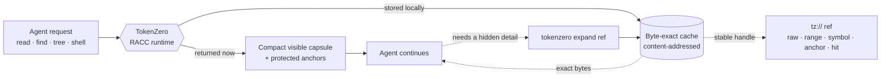
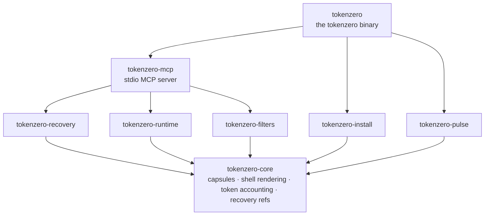

<div align="center">


<br/>
<br/>
<br/>

A local-first Rust runtime that shrinks what AI agents see, while keeping a
**byte-exact recovery handle** for everything it hides.

[](LICENSE)
&nbsp;
[](#mcp)
&nbsp;
[](#download--install)
&nbsp;
[](https://ko-fi.com/adityavg13)
&nbsp;
[](https://rust-lang.org)

<br/>

<a href="#highlights">Highlights</a> &nbsp;·&nbsp;
<a href="#how-racc-works">How it works</a> &nbsp;·&nbsp;
<a href="#demo">Demo</a> &nbsp;·&nbsp;
<a href="#architecture">Architecture</a> &nbsp;·&nbsp;
<a href="#download--install">Install</a> &nbsp;·&nbsp;
<a href="#commands">Commands</a> &nbsp;·&nbsp;
<a href="#mcp">MCP</a> &nbsp;·&nbsp;
<a href="#codemode">CodeMode</a> &nbsp;·&nbsp;
<a href="#choosing-a-mode">Choosing a mode</a> &nbsp;·&nbsp;
<a href="#zerostack">ZeroStack</a> &nbsp;·&nbsp;
<a href="#docs">Docs</a> &nbsp;·&nbsp;
<a href="#support">Support</a>

</div>

---

### Privacy and usage telemetry

Shareable usage telemetry is **off by default**. To opt in, set
`TOKENZERO_TELEMETRY=1`. To turn it off, unset the variable or set it to `0`.
When enabled, TokenZero appends only these three fields:
`execution_path`, `raw_tokens`, and `spent_tokens`.

Records stay in the local `usage-telemetry.jsonl` file beside the recovery
cache. TokenZero has no telemetry exporter. Nothing leaves the machine unless
you deliberately copy or export local data.

<h3 id="highlights"></h3>

<div align="center">


</div>

> Most compressors win context back by **throwing information away**, so the agent
> silently loses a detail it turns out to need. TokenZero returns a compact capsule
> *now* and keeps the omitted bytes behind an exact local ref. Savings are counted
> **after** any recovery, not from visible-token shrinkage alone.

Small reads pass through untouched; large reads collapse to a capsule, and both stay
**byte-exact recoverable**. Reproduce any row with `tokenzero read <file> --json`
and read the `accounting` block:

| Input | Raw tokens | Visible | Result |
| :-- | --: | --: | :-- |
| 204-line source file | 1,698 | 1,698 | returned whole; a capsule never costs more than raw |
| 796-line source file | 7,722 | 287 | **96.3%** smaller, exact bytes one `expand` away |
| 1,539-line source file | 12,908 | 259 | **98.0%** smaller, exact bytes one `expand` away |
| noisy shell output | 1,237 | 212 | **82.9%** smaller, full stream recoverable |

Hot paths are measured, not asserted: `cargo bench` pins token counting, capsule
framing, and shell rendering at microsecond scale on the workspace's criterion suite.

#### Benchmarks

`benchmarks/run_all.sh` runs the retained CLI cold-read, competitor, and
million-line navigation benchmarks with one pinned release binary. It writes
exact commands, provenance, failures, byte counts, and explicitly labeled
non-Q99 estimates to [`docs/benchmarks.md`](docs/benchmarks.md).

Large synthetic fixtures are generated on demand from
`tests/perf-corpus-manifest.json`; they are never source or release artifacts.
Use `uv run python scripts/perf_corpus.py generate`, then `verify`, and finish
with `clean --all`. Remote runs use the same disposable path:
`rch exec -- uv run python scripts/perf_corpus.py generate`.

Path-only outputs like `glob` pass through nearly unchanged: there is nothing
to hide, and a capsule never costs more than raw.

#### Measured in production

Across **~20,000 routed tool calls** from real agent sessions on one
development machine (six days, multiple AI harnesses): raw tool output
totalled **38.1M tokens**; **17.9M of them (47%) never entered the model's
context**. Counting back every token agents later recovered with `expand`,
net savings were **30%** in that local Pulse ledger. Treat this as deployment
telemetry, not a release claim; release-facing claims are gated by
`tokenzero claim-audit` artifacts. The auditable evidence bundle for this paragraph was pruned from the public
checkout; regenerate the ledger with `tokenzero pulse export-jsonl` if you
need it. Historical totals are not release-audited in this checkout until a
matching ledger is attached.

<h3 id="how-racc-works"></h3>

**RACC** is short for **Recovery-Aware Context Compression**. The goal is not the
shortest possible response; it is the **lowest total task cost** while exact recovery
stays one call away.



TokenZero may omit text from the visible capsule **only** when it is already
represented by a protected anchor, recoverable through an exact local ref, or the
mode explicitly declares lossy compression and reports that recovery may be needed.
Exact refs are local handles, not model-readable payloads, so honest evaluation
counts any later `expand` output the agent actually uses.

**Why recovery-aware beats lossy summarization.** A summarizer makes an
irreversible bet: it decides, before the task is finished, which details the
agent will never need. When it bets wrong, the agent re-reads files, re-runs
commands, or quietly fills the gap with a guess. RACC never has to bet.
It hides aggressively because hiding is reversible: every omitted byte stays
addressable behind a local `tz://` ref, and an agent that needs one gets the
exact original bytes back in a single call. The accounting follows the same
principle: tokens an agent later recovers are subtracted from claimed savings,
because compression you had to undo was never a saving at all.

<h3 id="demo"></h3>

Run the self-contained RACC demo from the repo root:

```powershell
pwsh -File ./demo/run_demo.ps1 -OpenViz
```

The demo requires PowerShell 7+ (`pwsh`) on Windows, Linux, or macOS. It
resolves `tokenzero` from `PATH`, reuses `demo/.tokenzero-bin/`, or downloads
the matching release asset for the current OS. It writes `demo/demo_results.json`
and `demo/demo_viz.html`, then shows raw tokens, visible tokens,
recovery-aware savings, and byte-exact expansion proof.

For live agent runs:

```powershell
pwsh -File ./demo/run_agent_demo.ps1 -Replicates 3
```

See [`demo/README.md`](demo/README.md) for options and the generated viewers.

<h3 id="architecture"></h3>

TokenZero is a layered Rust workspace of eight focused crates. Everything builds on a
single foundation crate; the MCP server and CLI compose the rest. The dependency graph
is acyclic; no crate reaches back up a layer.



| Crate | Responsibility |
| :-- | :-- |
| `tokenzero-core` | Capsules, adaptive shell rendering, token accounting, content typing: the foundation every other crate depends on |
| `tokenzero-recovery` | Content-addressed, byte-exact store behind `tz://` refs; bounded eviction and crash-safe persistence |
| `tokenzero-runtime` | Cross-platform process execution with stream capture and disk spill |
| `tokenzero-filters` | Conservative command rewriting and destructive-command safety verdicts |
| `tokenzero-install` | Agent integration (plan / apply / rollback), `doctor` diagnostics, archive `package-audit` |
| `tokenzero-pulse` | Local telemetry ledger (JSONL ↔ SQLite) so savings are accounted honestly, after recovery |
| `tokenzero-mcp` | The deterministic stdio MCP server: engine, tool dispatch, crash-transparent supervisor |
| `tokenzero` | The `tokenzero` binary and its command surface |

Building from source and the full workspace layout live in [`docs/development.md`](docs/development.md).

<h3 id="download--install"></h3>

Download the archive for your OS from the [latest Release](https://github.com/AdityaVG13/tokenzero/releases):

| OS | Asset |
| :-- | :-- |
| Windows | `tokenzero-<version>-x86_64-pc-windows-msvc.zip` |
| Linux | `tokenzero-<version>-x86_64-unknown-linux-gnu.tar.gz` |
| macOS (Apple Silicon) | `tokenzero-<version>-aarch64-apple-darwin.tar.gz` |
| macOS (Intel) | `tokenzero-<version>-x86_64-apple-darwin.tar.gz` |

Extract it, put `tokenzero` (or `tokenzero.exe`) on `PATH`, then:

```bash
tokenzero install --global --plan  --mcp --shell --cli --json   # preview, no writes
tokenzero install --global --apply --mcp --shell --cli --json   # apply safe local setup
tokenzero doctor --json                                         # confirm health
```

Every install step plans before it writes and records rollback data; replay it with
`tokenzero install --rollback <id>` to reverse an apply.

<details>
<summary><b>Prefer to let your AI agent do it?</b> Paste this prompt.</summary>

<br/>

```text
Install TokenZero for me from the latest GitHub Release at
https://github.com/AdityaVG13/tokenzero/releases. Pick the asset for my OS,
verify the SHA256 checksum, put the tokenzero binary on PATH, run the global
install plan, apply MCP/shell/CLI setup only if the plan is safe, then run
tokenzero doctor --json and show me the result.
```

</details>

A Homebrew tap (AdityaVG13/homebrew-zerostack) is being prepared; source builds
are the supported channel today. See [`docs/development.md`](docs/development.md).

## Install / Build

```bash
git clone https://github.com/AdityaVG13/tokenzero
cd tokenzero
cargo build --release
```

`rust-toolchain.toml` pins the nightly toolchain automatically. The binary lands at
`target/release/tokenzero`.

## Easy start (agents)

Paste this into your AI agent and it will set TokenZero up end to end:

```text
Set up TokenZero from https://github.com/AdityaVG13/tokenzero for me:
1. Clone it and run `cargo build --release` (rust-toolchain.toml pins the toolchain).
2. Register `target/release/tokenzero mcp-server --mode=mcp` as a stdio MCP server named "TokenZero" in my agent config.
3. For multi-engine or multi-step plans, enable the ZeroStack aggregate host; it launches `tokenzero-codemode` only as a planner-free raw worker.
4. Verify: call `tokenzero read README.md --json` against this repo and report the response envelope plus token savings.
```

One ZeroStack-wide prompt will ship when the unified ZeroStack meta-release lands; until then each engine sets up standalone.

<h3 id="commands"></h3>

Every command takes `--json` for a stable, schema-versioned envelope. Aliases match the
MCP tool names below.

<table>
<tr>
<td valign="top" width="50%">

**Read & search**

- `read <path>`: compact visible output + exact refs
- `find <query> [path]`: recoverable content search
- `grep <pattern> [path]`: exact-first regex / literal search
- `glob <pattern>`: match file paths, no contents
- `tree [path] --depth N`: bounded repo shape
- `run -- <command>`: shell / test / log capture

**Recover & transform**

- `expand <ref>`: recover payloads, ranges, symbols, anchors
- `recall <query>`: full-text search across the cache
- `fetch <url>`: cached HTTP fetch behind a ref
- `ingest --stdin --kind <k>`: store external output behind refs
- `edit <path>`: multi-hunk, all-or-nothing file edits

</td>
<td valign="top" width="50%">

**Measure & inspect**

- `stats`: savings accounting (raw vs visible, after recovery)
- `pulse`: telemetry ledger sync, export, doctor
- `mem`: inspect recovery / cache state
- `cache`: cache status and pruning
- `cache-pack`: compact a session into a portable pack
- `discover`: command / filter / runtime readiness
- `rewrite-command <cmd>`: conservative rewrite decisions

**Install, health & MCP**

- `doctor --json`: core health + config boundaries
- `install --plan` / `--apply` / `--rollback <id>`: planned setup with rollback
- `clients --json`: detect installed AI agents
- `mcp-server`: run the Rust stdio MCP server
- `mcp-smoke` / `mcp-soak --json`: conformance + chaos durability
- `package-audit --json`: release packaging audit

</td>
</tr>
</table>

<h3 id="mcp"></h3>

`tokenzero mcp-server` exposes deterministic stdio tools, each with a short alias. The
canonical `tz_*` name and the alias are interchangeable.

| Tool | Alias | | Tool | Alias |
| :-- | :-- | :-: | :-- | :-- |
| `tz_read` | `read` | | `tz_ingest` | `ingest` |
| `tz_find` | `find` | | `tz_expand` | `expand` |
| `tz_grep` | `grep` | | `tz_recall` | `recall` |
| `tz_glob` | `glob` | | `tz_fetch` | `fetch` |
| `tz_tree` | `tree` | | `tz_mem` | `mem` |
| `tz_shell` | `shell` | | `tz_cache_pack` | `cache_pack` |
| `tz_edit` | `edit` | | `tz_rewrite` | `rewrite` |
| `tz_batch` | `batch` | | `tz_discover` | `discover` |

The server is built on **FastMCP**: same tools, schemas, and payloads, with a
construction that bakes in production-grade failure semantics.

- **Request budgets.** Every call carries a timeout budget. A hung operation returns a
  clean budget-exceeded error, not an agent stall.
- **Cancel-correct.** A client disconnect cannot leave a half-written result. The
  server cancels in-flight work atomically; the next call sees a consistent state.
- **4-valued outcomes.** Every invocation resolves to exactly `success`, `cancelled`,
  `failed`, or `panicked`. Cancelled is not failed, and failed is not panicked;
  the harness can branch on the distinction instead of guessing from a
  catch-all error string.

The server negotiates the MCP protocol across `2025-03-26`, `2025-06-18` (default), and
the `2026-07-28` release candidate. Malformed JSON and cancelled or failed calls return
structured errors **without terminating the server**; a crash-transparent supervisor
restarts a faulted worker mid-session.

`tokenzero mcp-server --mode=mcp` launches the explicit classic compatibility catalog. Engine-local CodeMode mode was retired and fails loudly. Per-tool documentation lives at `resource://tokenzero/tools`.

<h3 id="codemode"></h3>

TokenZero publishes dotted aggregate bindings and a planner-free raw-worker v2 artifact. ZeroStack owns plan parsing, scheduling, transaction policy, permits, and multi-engine composition. The aggregate host dispatches TokenZero operations through `tokenzero-codemode`; despite its retained rollout name, that binary contains no local planner or MCP server.

TokenZero remains authoritative for tokenizer identity, roots, typed domain dispatch, exact refs, effects, output caps, and telemetry. See [`docs/codemode.md`](docs/codemode.md) for the ownership boundary and binding catalog.

<h3 id="choosing-a-mode"></h3>

Choose classic MCP for direct per-operation compatibility. Choose the ZeroStack aggregate host for plans and multi-engine composition.

| | Classic MCP compatibility | ZeroStack aggregate |
| :-- | :-- | :-- |
| **Surface** | Per-operation `tz_*` tools | Dotted `zero.*` bindings across engines |
| **Pattern** | One MCP call per operation | Plans composed by the hub |
| **TokenZero process** | `tokenzero mcp-server --mode=mcp` | Planner-free `tokenzero-codemode raw-worker` |
| **Owner** | TokenZero compatibility package | ZeroStack |

<h3 id="zerostack"></h3>

TokenZero is complete on its own; everything above works with this repo
alone. It is also the context runtime of the **ZeroStack** suite: three
engines that each stand alone, plus an optional hub that unifies them under
one `zero.*` surface for users who want all three.

| Engine | Role | Status |
| :-- | :-- | :-- |
| **TokenZero** | Context compression + recovery | `stable` |
| [**FSZero**](https://github.com/AdityaVG13/FSZero) | Executable filesystem + repo RAG + access memory | coming soon, hardening |
| [**GraphZero**](https://github.com/AdityaVG13/graphzero) | Code graph + causality + decision memory | coming soon, hardening |

The engines share content-addressed blob identity: the same bytes hash to the
same ref whether it was minted as `tz://`, `fz://`, or `gz://`. `fz://` and
`gz://` still act as **same-store scheme aliases** when rewritten into the
TokenZero store. Release publication of cross-engine **blob** expand under a verified shared
ZeroStack CAS (and sibling-engine store fallback) is blocked until CI retains a
green macOS/Linux/Windows ZeroRef v1 3×3 matrix. The checked-in fixture may be
a host-only diagnostic snapshot and does not authorize release. Non-blob
portable refs remain unsupported; see `docs/codemode.md`.

The [ZeroStack hub](https://github.com/AdityaVG13/ZeroStack) ships the unified
CodeMode server (one `zero_execute` tool spanning all three engines), an
agent-executable install runbook, and the combined benchmark suite.

<h3 id="docs"></h3>

| Doc | Covers |
| :-- | :-- |
| [docs/codemode.md](docs/codemode.md) | Plan execution, MCP comparison, background jobs, refs, and bounds |
| [docs/mcp.md](docs/mcp.md) | Direct MCP compatibility contract and protocol versions |
| [docs/install.md](docs/install.md) | Install, surface selection, migration, and rollback |
| [docs/command-coverage.md](docs/command-coverage.md) | Command surface coverage |
| [docs/pulse.md](docs/pulse.md) | Telemetry, sync strategy, and recovery runbook |
| [docs/racc.md](docs/racc.md) | RACC contract and savings accounting |
| [docs/radc-non-claims.md](docs/radc-non-claims.md) | Explicit non-claims: what TokenZero does not claim |
| [formal/cont2/README.md](formal/cont2/README.md) | Optional Cont-2 formal regression (`python3 scripts/radc-check`); not a product gate |
| [docs/benchmarks.md](docs/benchmarks.md) | Reproducible savings and microbenchmarks |
| [docs/development.md](docs/development.md) | Build from source, targeted verification, and workspace layout |

<h3 id="contributing"></h3>

See [`CONTRIBUTING.md`](CONTRIBUTING.md) for the build/verify loop and
[`SECURITY.md`](SECURITY.md) for disclosure. The verify gate is
`cargo test --workspace`, `cargo clippy --workspace --all-targets -- -D warnings`, and
`cargo fmt --all -- --check`.

<h3 id="license"></h3>

[MIT](LICENSE) © AdityaVG13

---

<h3 id="support"></h3>

<div align="center">

If TokenZero saves you tokens, consider fueling its development. ☕

[](https://ko-fi.com/adityavg13)

<sub><b>Compress aggressively. Recover exactly. One install.</b></sub>

</div>
