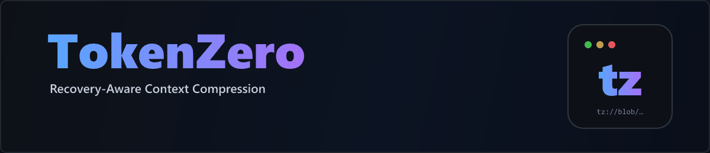
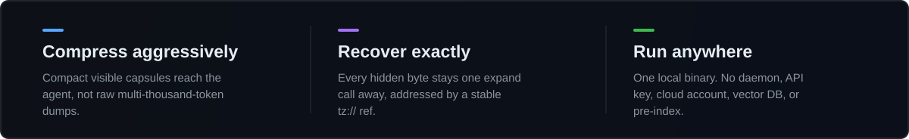
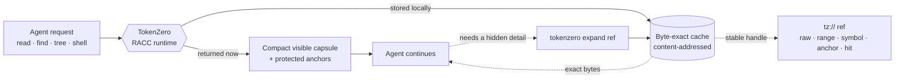

<div align="center">



<br/>
<br/>
<br/>

A local-first Rust runtime that shrinks what AI agents see, while keeping a
**byte-exact recovery handle** for everything it hides.

[](LICENSE)
&nbsp;
[](#mcp)
&nbsp;
[](#download--install)
&nbsp;
[](https://ko-fi.com/adityavg13)

<br/>

<a href="#highlights">Highlights</a> &nbsp;·&nbsp;
<a href="#how-racc-works">How it works</a> &nbsp;·&nbsp;
<a href="#download--install">Install</a> &nbsp;·&nbsp;
<a href="#commands">Commands</a> &nbsp;·&nbsp;
<a href="#mcp">MCP</a> &nbsp;·&nbsp;
<a href="#docs">Docs</a> &nbsp;·&nbsp;
<a href="#support">Support</a>

</div>

---

<h3 id="highlights"></h3>

<div align="center">



</div>

> Most compressors win context back by **throwing information away**, so the agent
> silently loses a detail it turns out to need. TokenZero returns a compact capsule
> *now* and keeps the omitted bytes behind an exact local ref. Savings are counted
> **after** any recovery, not from visible-token shrinkage alone.

<h3 id="how-racc-works"></h3>

**RACC -- Recovery-Aware Context Compression.** The goal is not the shortest possible
response; it is the **lowest total task cost** while exact recovery stays one call away.



TokenZero may omit text from the visible capsule **only** when it is already
represented by a protected anchor, recoverable through an exact local ref, or the
mode explicitly declares lossy compression and reports that recovery may be needed.
Exact refs are local handles, not model-readable payloads -- so honest evaluation
counts any later `expand` output the agent actually uses.

<h3 id="download--install"></h3>

> ⚠️ **Pre-launch.** This checkout builds and verifies locally. No public releases,
> remote pushes, or global mutations without explicit approval.

Download the archive for your OS from the [latest Release](https://github.com/AdityaVG13/tokenzero/releases):

| OS | Asset |
| :-- | :-- |
| Windows | `tokenzero-<version>-x86_64-pc-windows-msvc.zip` |
| Linux | `tokenzero-<version>-x86_64-unknown-linux-gnu.tar.gz` |
| macOS (Apple Silicon) | `tokenzero-<version>-aarch64-apple-darwin.tar.gz` |
| macOS (Intel) | `tokenzero-<version>-x86_64-apple-darwin.tar.gz` |

Extract it, put `tokenzero` (or `tokenzero.exe`) on `PATH`, then:

```bash
tokenzero install --global --plan  --mcp --shell --cli --json   # preview, no writes
tokenzero install --global --apply --mcp --shell --cli --json   # apply safe local setup
tokenzero doctor --json                                         # confirm health
```

<details>
<summary><b>Prefer to let your AI agent do it?</b> Paste this prompt.</summary>

<br/>

```text
Install TokenZero for me from the latest GitHub Release at
https://github.com/AdityaVG13/tokenzero/releases. Pick the asset for my OS,
verify the SHA256 checksum, put the tokenzero binary on PATH, run the global
install plan, apply MCP/shell/CLI setup only if the plan is safe, then run
tokenzero doctor --json and show me the result.
```

</details>

Cargo, Homebrew, and npm channels land here at launch. Building from source? See [`docs/development.md`](docs/development.md).

<h3 id="commands"></h3>

<table>
<tr>
<td valign="top" width="50%">

**Read & search**

- `read <path>` -- compact visible output + exact refs
- `find <query> [path]` -- search local roots, recoverable hits
- `tree [path] --depth N` -- bounded repo shape
- `run -- <command>` -- shell / test / log capture

**Recover & inspect**

- `expand <ref>` -- recover payloads, ranges, symbols, anchors
- `ingest --stdin --kind <k>` -- store external output behind refs
- `mem` -- inspect recovery / cache state
- `rewrite-command <cmd>` -- conservative rewrite decisions
- `discover` -- command / filter / runtime readiness

</td>
<td valign="top" width="50%">

**Install & health**

- `doctor --json` -- core health + config boundaries
- `install --plan --json` -- plan setup, no writes
- `install --apply --json` -- apply safe setup, with rollback

**MCP & checks**

- `mcp-server` -- run the Rust stdio MCP server
- `mcp-smoke --json` -- MCP conformance smoke
- `mcp-soak --json` -- restart / chaos durability
- `shell-matrix --json` -- non-interactive shell behavior
- `package-audit --json` -- release-only packaging audit

</td>
</tr>
</table>

<h3 id="mcp"></h3>

`tokenzero mcp-server` exposes deterministic stdio tools, each with a short alias.

| Tool | Alias | | Tool | Alias |
| :-- | :-- | :-: | :-- | :-- |
| `tz_read` | `read` | | `tz_ingest` | `ingest` |
| `tz_find` | `find` | | `tz_expand` | `expand` |
| `tz_tree` | `tree` | | `tz_mem` | `mem` |
| `tz_shell` | `shell` | | `tz_rewrite` | `rewrite` |
| `tz_discover` | `discover` | | | |

The server supports the legacy MCP flow and the current `2026-07-28`
release-candidate shape. Malformed JSON and cancelled or failed calls return
structured errors **without terminating the server**.

<h3 id="docs"></h3>

| Doc | Covers |
| :-- | :-- |
| [`docs/core.md`](docs/core.md) | Core command surfaces |
| [`docs/racc.md`](docs/racc.md) | RACC contract and accounting |
| [`docs/mcp.md`](docs/mcp.md) | MCP server contract |
| [`docs/install.md`](docs/install.md) | Install, plan, apply, rollback |
| [`docs/development.md`](docs/development.md) | Build from source, test, verify, workspace |
| [`docs/windows-systemwide.md`](docs/windows-systemwide.md) | Windows systemwide migration runbook |

<h3 id="contributing"></h3>

See [`CONTRIBUTING.md`](CONTRIBUTING.md) for the build/verify loop and
[`SECURITY.md`](SECURITY.md) for disclosure. Pre-launch: no public releases,
remote pushes, or global mutations without explicit approval.

<h3 id="license"></h3>

[MIT](LICENSE) © TokenZero

---

<h3 id="support"></h3>

<div align="center">

If TokenZero saves you tokens, consider fueling its development. ☕

[](https://ko-fi.com/adityavg13)

<sub><b>Compress aggressively. Recover exactly. One install.</b></sub>

</div>
