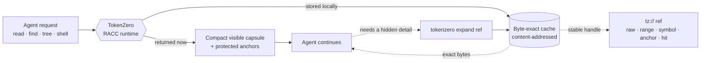
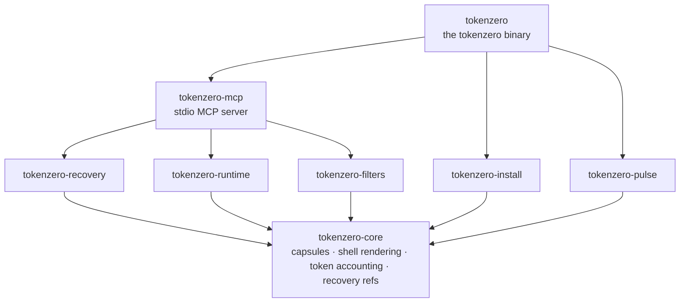

<div align="center">


<br/>
<br/>
<br/>

A local-first Rust runtime that shrinks what AI agents see, while keeping a
**byte-exact recovery handle** for everything it hides.

[](LICENSE)
&nbsp;
[](#mcp)
&nbsp;
[](#download--install)
&nbsp;
[](https://ko-fi.com/adityavg13)

<br/>

<a href="#highlights">Highlights</a> &nbsp;·&nbsp;
<a href="#how-racc-works">How it works</a> &nbsp;·&nbsp;
<a href="#demo">Demo</a> &nbsp;·&nbsp;
<a href="#architecture">Architecture</a> &nbsp;·&nbsp;
<a href="#download--install">Install</a> &nbsp;·&nbsp;
<a href="#commands">Commands</a> &nbsp;·&nbsp;
<a href="#mcp">MCP</a> &nbsp;·&nbsp;
<a href="#docs">Docs</a> &nbsp;·&nbsp;
<a href="#support">Support</a>

</div>

---

<h3 id="highlights"></h3>

<div align="center">


</div>

> Most compressors win context back by **throwing information away**, so the agent
> silently loses a detail it turns out to need. TokenZero returns a compact capsule
> *now* and keeps the omitted bytes behind an exact local ref. Savings are counted
> **after** any recovery, not from visible-token shrinkage alone.

Small reads pass through untouched; large reads collapse to a capsule, and both stay
**byte-exact recoverable**. Reproduce any row with `tokenzero read <file> --json`
and read the `accounting` block:

| Input | Raw tokens | Visible | Result |
| :-- | --: | --: | :-- |
| 237-line source file | 1,992 | 1,992 | returned whole; a capsule never costs more than raw |
| 1,728-line source file | 13,764 | 203 | **98.5%** smaller, exact bytes one `expand` away |
| 2,301-line source file | 16,712 | 150 | **99.1%** smaller, exact bytes one `expand` away |
| noisy shell output | 1,012 | 435 | **57%** smaller, full stream recoverable |

Hot paths are measured, not asserted: `cargo bench` pins token counting, capsule
framing, and shell rendering at microsecond scale on the workspace's criterion suite.

#### End-to-end benchmark

Six real workloads on this repository, run raw and through TokenZero. Both
sides are counted with the same tokenizer (TokenZero's own accounting), and
every TokenZero row keeps exact `tz://` refs, so nothing hidden is more than
one `expand` away. The current reproducible demo artifact is
`demo/demo_results.json`:

| Workload | Raw tokens | TokenZero | Savings |
| :-- | --: | --: | --: |
| Small read (`Cargo.toml`) | 324 | 324 | **0%** |
| Large read (`crates/tokenzero-mcp/src/lib.rs`) | 16,977 | 150 | **99.1%** |
| Re-read the same file (MCP dedup) | 16,977 | 185 | **98.9%** |
| Repo-wide grep (`fn ` across `crates/`) | 79,424 | 508 | **99.4%** |
| Re-find stored content (`recall` vs re-running the grep) | 79,424 | 46 | **99.9%** |
| `run -- git --version` | 11 | 11 | **0%** |
| **Total** | **193,137** | **1,224** | **99.4%** |

Path-only outputs like `glob` pass through nearly unchanged: there is nothing
to hide, and a capsule never costs more than raw.

#### Plan composition benchmark

CodeMode executes multi-step plans in a single call, eliminating per-operation
round-trips. The same engine and tokenizer measure both sides; the "Direct"
column is the sum of running each step individually:

| Workload | Plan (visible) | Direct (visible) | Savings |
| :-- | --: | --: | --: |
| File + search + transform | 775 | 2,843 | **72.7%** |
| Shell multi-step (3 commands) | 949 | 1,227 | **22.7%** |
| Pipe composition (read + compact) | 261 | 1,266 | **79.4%** |
| Mixed exploration (tree + glob + read) | 917 | 1,733 | **47.1%** |
| **Total** | **2,902** | **7,069** | **58.9%** |

Reproducible: `scripts/benchmark_composition.sh` or
`cargo test -p tokenzero-mcp -- codemode::bench_tests::run_composition_benchmark`.
Artifact: `demo/composition_benchmark.json`.

Dogfood from OMP / ZeroStack router:

```text
zero_execute root=/path/to/repo plan='const out = await zero.token.compact("payload"); return { ref: out.ref };'
```

Dogfood locally without OMP:

```bash
tokenzero codemode --json --root . --plan '{"steps":[{"id":"c","method":"zero.token.compact","args":["payload"]},{"id":"e","method":"zero.token.expand","args":["$c.ref"]}],"return":{"text":"$e.text","ref":"$c.ref"}}'
```

MCP launch mode is explicit:

- `tokenzero mcp-server --mode=mcp` (default) exposes only the per-operation tools (`tz_read`, `tz_find`, `tz_expand`, ...).
- `tokenzero mcp-server --mode=codemode` exposes exactly `tz_execute_code`, `tz_codemode_search`, and `tz_codemode_describe`; per-operation tools are hidden in that process.

`tokenzero codemode` remains the local CLI entry point for the same native executor.

#### Measured in production

Across **~20,000 routed tool calls** from real agent sessions on one
development machine (six days, multiple AI harnesses): raw tool output
totalled **38.1M tokens**; **17.9M of them (47%) never entered the model's
context**. Counting back every token agents later recovered with `expand`,
net savings were **30%** in that local Pulse ledger. Treat this as deployment
telemetry, not a release claim; release-facing claims are gated by
`tokenzero claim-audit` artifacts.

<h3 id="how-racc-works"></h3>

**RACC** is short for **Recovery-Aware Context Compression**. The goal is not the
shortest possible response; it is the **lowest total task cost** while exact recovery
stays one call away.



TokenZero may omit text from the visible capsule **only** when it is already
represented by a protected anchor, recoverable through an exact local ref, or the
mode explicitly declares lossy compression and reports that recovery may be needed.
Exact refs are local handles, not model-readable payloads, so honest evaluation
counts any later `expand` output the agent actually uses.

**Why recovery-aware beats lossy summarization.** A summarizer makes an
irreversible bet: it decides, before the task is finished, which details the
agent will never need. When it bets wrong, the agent re-reads files, re-runs
commands, or quietly fills the gap with a guess. RACC never has to bet.
It hides aggressively because hiding is reversible: every omitted byte stays
addressable behind a local `tz://` ref, and an agent that needs one gets the
exact original bytes back in a single call. The accounting follows the same
principle: tokens an agent later recovers are subtracted from claimed savings,
because compression you had to undo was never a saving at all.

<h3 id="demo"></h3>

Run the self-contained RACC demo from the repo root:

```bash
pwsh -File ./demo/run_demo.ps1 -OpenViz
```

The demo requires PowerShell 7+ (`pwsh`) on Windows, Linux, or macOS. It
resolves `tokenzero` from `PATH`, reuses `demo/.tokenzero-bin/`, or downloads
the matching release asset for the current OS. It writes `demo/demo_results.json`
and `demo/demo_viz.html`, then shows raw tokens, visible tokens,
recovery-aware savings, and byte-exact expansion proof.

For live agent runs:

```bash
pwsh -File ./demo/run_agent_demo.ps1 -Replicates 3
```

See [`demo/README.md`](demo/README.md) for options and the generated viewers.

<h3 id="architecture"></h3>

TokenZero is a layered Rust workspace of eight focused crates. Everything builds on a
single foundation crate; the MCP server and CLI compose the rest. The dependency graph
is acyclic; no crate reaches back up a layer.



| Crate | Responsibility |
| :-- | :-- |
| `tokenzero-core` | Capsules, adaptive shell rendering, token accounting, content typing: the foundation every other crate depends on |
| `tokenzero-recovery` | Content-addressed, byte-exact store behind `tz://` refs; bounded eviction and crash-safe persistence |
| `tokenzero-runtime` | Cross-platform process execution with stream capture and disk spill |
| `tokenzero-filters` | Conservative command rewriting and destructive-command safety verdicts |
| `tokenzero-install` | Agent integration (plan / apply / rollback), `doctor` diagnostics, archive `package-audit` |
| `tokenzero-pulse` | Local telemetry ledger (JSONL ↔ SQLite) so savings are accounted honestly, after recovery |
| `tokenzero-mcp` | The deterministic stdio MCP server: engine, tool dispatch, crash-transparent supervisor |
| `tokenzero` | The `tokenzero` binary and its command surface |

Building from source and the full workspace layout live in [`docs/development.md`](docs/development.md).

<h3 id="download--install"></h3>

Download the archive for your OS from the [latest Release](https://github.com/AdityaVG13/tokenzero/releases):

| OS | Asset |
| :-- | :-- |
| Windows | `tokenzero-<version>-x86_64-pc-windows-msvc.zip` |
| Linux | `tokenzero-<version>-x86_64-unknown-linux-gnu.tar.gz` |
| macOS (Apple Silicon) | `tokenzero-<version>-aarch64-apple-darwin.tar.gz` |
| macOS (Intel) | `tokenzero-<version>-x86_64-apple-darwin.tar.gz` |

Extract it, put `tokenzero` (or `tokenzero.exe`) on `PATH`, then:

```bash
tokenzero install --global --plan  --mcp --shell --cli --json   # preview, no writes
tokenzero install --global --apply --mcp --shell --cli --json   # apply safe local setup
tokenzero doctor --json                                         # confirm health
```

Every install step plans before it writes and records rollback data; replay it with
`tokenzero install --rollback <id>` to reverse an apply.

<details>
<summary><b>Prefer to let your AI agent do it?</b> Paste this prompt.</summary>

<br/>

```text
Install TokenZero for me from the latest GitHub Release at
https://github.com/AdityaVG13/tokenzero/releases. Pick the asset for my OS,
verify the SHA256 checksum, put the tokenzero binary on PATH, run the global
install plan, apply MCP/shell/CLI setup only if the plan is safe, then run
tokenzero doctor --json and show me the result.
```

</details>

Cargo, Homebrew, and npm channels ship alongside the GitHub Releases. Building from
source? See [`docs/development.md`](docs/development.md).

<h3 id="commands"></h3>

Every command takes `--json` for a stable, schema-versioned envelope. Aliases match the
MCP tool names below.

<table>
<tr>
<td valign="top" width="50%">

**Read & search**

- `read <path>`: compact visible output + exact refs
- `find <query> [path]`: recoverable content search
- `grep <pattern> [path]`: exact-first regex / literal search
- `glob <pattern>`: match file paths, no contents
- `tree [path] --depth N`: bounded repo shape
- `run -- <command>`: shell / test / log capture

**Recover & transform**

- `expand <ref>`: recover payloads, ranges, symbols, anchors
- `recall <query>`: full-text search across the cache
- `fetch <url>`: cached HTTP fetch behind a ref
- `ingest --stdin --kind <k>`: store external output behind refs
- `edit <path>`: multi-hunk, all-or-nothing file edits

</td>
<td valign="top" width="50%">

**Measure & inspect**

- `stats`: savings accounting (raw vs visible, after recovery)
- `pulse`: telemetry ledger sync, export, doctor
- `mem`: inspect recovery / cache state
- `cache`: cache status and pruning
- `cache-pack`: compact a session into a portable pack
- `discover`: command / filter / runtime readiness
- `rewrite-command <cmd>`: conservative rewrite decisions

**Install, health & MCP**

- `doctor --json`: core health + config boundaries
- `install --plan` / `--apply` / `--rollback <id>`: planned setup with rollback
- `clients --json`: detect installed AI agents
- `mcp-server`: run the Rust stdio MCP server
- `mcp-smoke` / `mcp-soak --json`: conformance + chaos durability
- `package-audit --json`: release packaging audit

</td>
</tr>
</table>

<h3 id="mcp"></h3>

`tokenzero mcp-server` exposes deterministic stdio tools, each with a short alias. The
canonical `tz_*` name and the alias are interchangeable.

| Tool | Alias | | Tool | Alias |
| :-- | :-- | :-: | :-- | :-- |
| `tz_read` | `read` | | `tz_ingest` | `ingest` |
| `tz_find` | `find` | | `tz_expand` | `expand` |
| `tz_grep` | `grep` | | `tz_recall` | `recall` |
| `tz_glob` | `glob` | | `tz_fetch` | `fetch` |
| `tz_tree` | `tree` | | `tz_mem` | `mem` |
| `tz_shell` | `shell` | | `tz_cache_pack` | `cache_pack` |
| `tz_edit` | `edit` | | `tz_rewrite` | `rewrite` |
| `tz_batch` | `batch` | | `tz_discover` | `discover` |

The server negotiates the MCP protocol across `2025-03-26`, `2025-06-18` (default), and
the `2026-07-28` release candidate. Malformed JSON and cancelled or failed calls return
structured errors **without terminating the server**; a crash-transparent supervisor
restarts a faulted worker mid-session.

<h3 id="docs"></h3>

| Doc | Covers |
| :-- | :-- |
| [`docs/core.md`](docs/core.md) | Core command surfaces |
| [`docs/racc.md`](docs/racc.md) | RACC contract and savings accounting |
| [`docs/benchmarks.md`](docs/benchmarks.md) | Reproducible savings + microbenchmarks |
| [`docs/mcp.md`](docs/mcp.md) | MCP server contract and protocol versions |
| [`docs/install.md`](docs/install.md) | Install, plan, apply, rollback |
| [`docs/pulse.md`](docs/pulse.md) | Telemetry ledger and savings measurement |
| [`docs/pulse-sync-strategy.md`](docs/pulse-sync-strategy.md) | JSONL ↔ SQLite sync design |
| [`docs/pulse-recovery-runbook.md`](docs/pulse-recovery-runbook.md) | Ledger recovery runbook |
| [`docs/routing.md`](docs/routing.md) | Agent / client routing |
| [`docs/command-coverage.md`](docs/command-coverage.md) | Command surface coverage |
| [`docs/development.md`](docs/development.md) | Build from source, test, verify, workspace |
| [`docs/windows-systemwide.md`](docs/windows-systemwide.md) | Windows systemwide migration runbook |

<h3 id="contributing"></h3>

See [`CONTRIBUTING.md`](CONTRIBUTING.md) for the build/verify loop and
[`SECURITY.md`](SECURITY.md) for disclosure. The verify gate is
`cargo test --workspace`, `cargo clippy --workspace --all-targets -- -D warnings`, and
`cargo fmt --all -- --check`.

<h3 id="license"></h3>

[MIT](LICENSE) © AdityaVG13

---

<h3 id="support"></h3>

<div align="center">

If TokenZero saves you tokens, consider fueling its development. ☕

[](https://ko-fi.com/adityavg13)

<sub><b>Compress aggressively. Recover exactly. One install.</b></sub>

</div>
